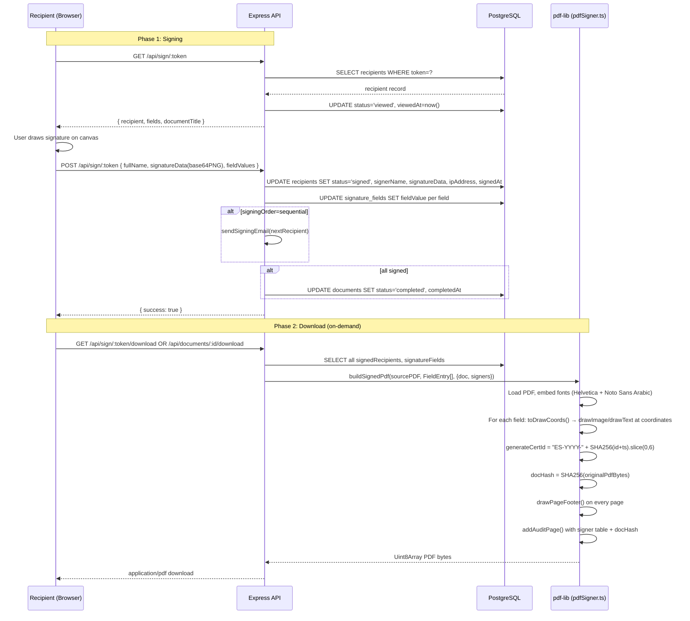
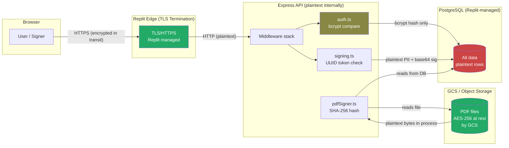
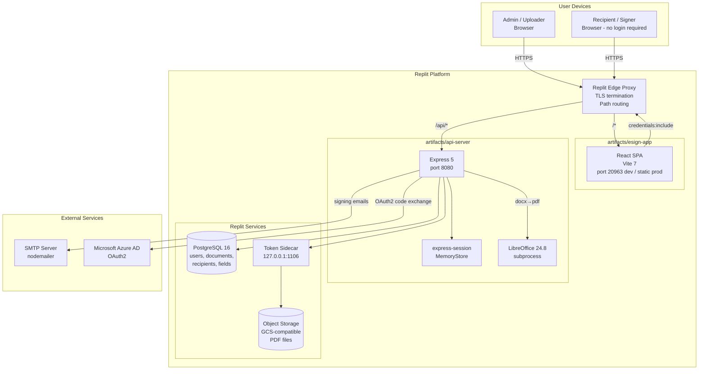
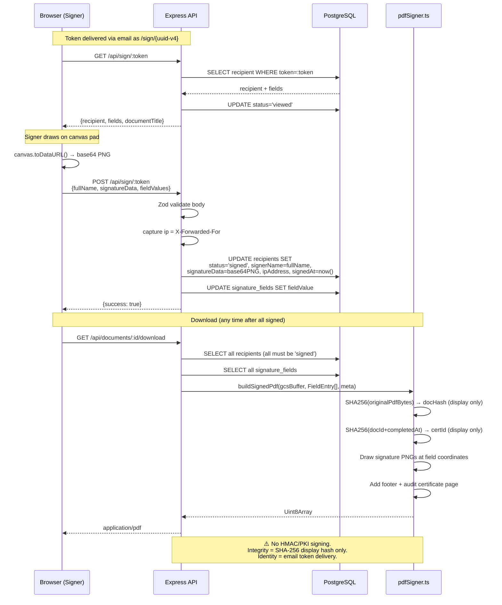

# INFRASTRUCTURE.md — WorkflowSign (SOS Village Palestine E-Signature System)

> **Generated from live codebase.** Every claim references a real file/function. Tags: `[IMPLEMENTED]`, `[PARTIAL]`, `[PLANNED]`.

---

## 1. System Overview

WorkflowSign is a full-stack DocuSign-style e-signature platform built for SOS Children's Villages Palestine. It enables authenticated team members to upload PDF or Word documents, place signature fields per recipient, and collect legally-tracked signatures via unique per-recipient email links. The system runs as a **SPA + API** pair: a React/Vite frontend served as static files and an Express 5 API server, both behind Replit's reverse proxy. All persistent state lives in a Replit-provisioned PostgreSQL 16 database, and uploaded documents are stored in Replit Object Storage (GCS-compatible).

---

## 2. Tech Stack & Versions

| Layer | Package | Version | Purpose |
|---|---|---|---|
| Runtime | Node.js | 24.13.0 | Server runtime |
| Package manager | pnpm | 10.26.1 | Monorepo workspace |
| Language | TypeScript | ~5.9.2 | All source |
| Backend framework | express | ^5 | HTTP server |
| Session middleware | express-session | ^1.19.0 | Cookie-based sessions |
| Password hashing | bcryptjs | ^3.0.3 | User passwords |
| ORM | drizzle-orm | ^0.45.2 | PostgreSQL queries |
| Database | PostgreSQL | 16 | Primary data store |
| File storage | @google-cloud/storage | ^7.21.0 | Replit Object Storage (GCS) |
| PDF generation | pdf-lib | ^1.17.1 | Signing overlays + audit page |
| PDF font embedding | @pdf-lib/fontkit | ^1.1.1 | Custom font support |
| Arabic font | @fontsource/noto-sans-arabic | ^5.2.10 | RTL text rendering in PDFs |
| Email | nodemailer | ^9.0.1 | Signing invitation emails |
| Logging | pino + pino-http | ^9 / ^10 | Structured JSON logging |
| UUID generation | uuid | ^14.0.0 | All IDs and tokens |
| CORS | cors | ^2 | Cross-origin headers |
| Cookie parsing | cookie-parser | ^1.4.7 | Cookie header parsing |
| Frontend framework | React | 19.1.0 | UI |
| Build tool | Vite | ^7.3.5 | Frontend dev + production build |
| Router | wouter | ^3.3.5 | Client-side routing |
| Data fetching | @tanstack/react-query | ^5.90.21 | API state management |
| PDF viewer | react-pdf | ^10.4.1 | Inline PDF rendering |
| UI components | Radix UI + shadcn/ui | various | Accessible component primitives |
| Validation | zod | ^3.25.76 | Input validation (server + client) |
| API codegen | Orval (config in `lib/api-spec`) | — | Generates hooks + Zod schemas |
| Word conversion | LibreOffice | 24.8.7.2 | DOCX → PDF server-side |
| Azure SSO | raw `fetch` (no SDK) | — | Microsoft OAuth2 PKCE-lite |

---

## 3. Repository Structure

```
workspace/
├── artifacts/
│   ├── api-server/          # Express 5 API — the backend service
│   │   ├── src/
│   │   │   ├── app.ts       # Middleware stack assembly
│   │   │   ├── index.ts     # HTTP server startup
│   │   │   ├── routes/      # Route handlers (auth, documents, signing, admin…)
│   │   │   └── lib/         # Logger, GCS storage, appUrl helpers
│   │   ├── build.mjs        # esbuild bundler script
│   │   └── dist/            # Compiled output (index.mjs, pino workers)
│   ├── esign-app/           # React/Vite SPA — the frontend
│   │   ├── src/
│   │   │   ├── pages/       # Route-level page components
│   │   │   └── components/  # Shared UI, pdf-viewer, signature pad
│   │   ├── public/          # Static assets (pdf.worker.min.mjs, favicon)
│   │   └── dist/public/     # Production static build output
│   └── mockup-sandbox/      # Vite dev server for canvas component previews
├── lib/
│   ├── db/                  # Drizzle schema, migrations, db client
│   ├── api-spec/            # openapi.yaml — source of truth for the API contract
│   ├── api-client-react/    # Generated TanStack Query hooks (do not edit)
│   └── api-zod/             # Generated Zod schemas (do not edit)
├── scripts/
│   └── post-merge.sh        # Runs DB migrations after task merges
├── pnpm-workspace.yaml      # Workspace config, catalog versions, security settings
├── tsconfig.json            # Solution tsconfig (libs only)
├── tsconfig.base.json       # Shared strict TS defaults
└── replit.nix               # Nix system deps: libreoffice
```

---

## 4. Runtime & Hosting (Replit specifics)

### Boot sequence

| Stage | Command | File |
|---|---|---|
| Dev (API) | `export NODE_ENV=development && pnpm run build && pnpm run start` | `artifacts/api-server/package.json` |
| Dev (frontend) | `vite --config vite.config.ts --host 0.0.0.0` | `artifacts/esign-app/package.json` |
| Prod (API) | `node --enable-source-maps artifacts/api-server/dist/index.mjs` | `artifacts/api-server/.replit-artifact/artifact.toml` |
| Prod (frontend) | Static file serving (Replit CDN) | `artifacts/esign-app/.replit-artifact/artifact.toml` |

- **Entry file**: `artifacts/api-server/src/index.ts` reads `PORT` from env, calls `app.listen()`. Throws if `PORT` is absent.
- **Build**: esbuild (`build.mjs`) bundles API to single `dist/index.mjs` (ESM, ~4.9 MB). Vite builds frontend to `dist/public/`.
- **PORT**: `PORT=8080` (API), `PORT=20963` (frontend dev). Assigned by Replit via artifact config.
- **Proxy routing**: Replit reverse proxy maps `/api/*` → API (port 8080), `/*` → frontend (port 20963 in dev, static in prod).
- **TLS**: Terminated by Replit's edge proxy. The app never handles raw TLS.
- **`trust proxy 1`**: Set in `app.ts` line 11 so `req.ip`, `req.protocol`, and `X-Forwarded-*` headers are correctly resolved.
- **Health check**: `GET /api/healthz` returns `{"status":"ok"}`. Used by deployment platform for startup detection (`artifacts/api-server/.replit-artifact/artifact.toml`).
- **Production SPA rewrites**: `/sign/*` → `sign.html` (noindex page), `/*` → `index.html`.
- **Deployment type**: Autoscale (`deploymentTarget = "autoscale"` in `.replit`).
- **Secrets**: Managed via Replit Secrets UI, injected as environment variables at runtime. Never committed to source.
- **Post-merge**: `scripts/post-merge.sh` runs `pnpm --filter @workspace/db run push` after task agent merges.

---

## 5. Frontend Architecture

- **Framework**: React 19.1.0, functional components, hooks.
- **Routing**: wouter 3.3.5 (client-side). Two entry HTML files: `index.html` (authenticated app) and `sign.html` (public signing, `noindex`).
- **State management**: TanStack Query v5 for server state; React `useState`/`useContext` for local state.
- **Build**: Vite 7, `base` set from `BASE_PATH` env var (defaults `/`). PDF.js split into a separate chunk (`vendor-pdf`) to avoid 420KB impacting main bundle.
- **API communication**: Generated hooks in `lib/api-client-react/src/generated/` call relative URLs (e.g. `/api/...`). All calls use `credentials: "include"` to send session cookies.
- **Sensitive data on client**:
  - Signature images are drawn in a `<canvas>` pad, converted to base64 PNG via `canvas.toDataURL()`, then `POST`-ed to the API. The image data transits in the JSON body (base64-encoded, over HTTPS). ⚠️ Base64 is **NOT encryption** — it is transport encoding only.
  - The signed PNG is stored in `localStorage` / session for reuse within a tab session in some flows. This is not encrypted.
- **PDF viewer**: `react-pdf` (pdfjs-dist v4). Worker served from `/pdf.worker.min.mjs` (copied to `public/`). PDF is fetched from authenticated endpoint `/api/documents/:id/file` or public endpoint `/api/sign/:token/file`.

---

## 6. Backend Architecture

### Middleware stack (in order — `artifacts/api-server/src/app.ts`)

| Order | Middleware | Config | Notes |
|---|---|---|---|
| 1 | `trust proxy 1` | — | Corrects `req.ip` behind Replit reverse proxy |
| 2 | `pinoHttp` | Redacts `authorization`, `cookie`, `set-cookie` headers | Structured request/response logging |
| 3 | `cors` | `origin: true`, `credentials: true` | ⚠️ **RISK: accepts any origin with cookies** (see §17) |
| 4 | `express.json` | `limit: "70mb"` | Body parsing for JSON (incl. base64 file uploads) |
| 5 | `express.urlencoded` | `limit: "70mb"`, `extended: true` | URL-encoded body parsing |
| 6 | `express-session` | See §10 | Cookie-based session management |
| 7 | `/api` router | — | All application routes mounted under `/api` |

### Route organisation

Routes are split into focused modules (`artifacts/api-server/src/routes/`):

| Module | File | Mount |
|---|---|---|
| Health | `health.ts` | `/api/healthz`, `/api/` |
| Auth | `auth.ts` | `/api/auth/*` |
| Documents | `documents.ts` | `/api/documents/*` |
| Recipients | `recipients.ts` | `/api/documents/:id/recipients`, `/api/documents/:id/send` |
| Signing | `signing.ts` | `/api/sign/*`, `/api/signing/*` |
| Admin | `admin.ts` | `/api/admin/*` |

### Input validation

All incoming bodies validated with Zod schemas from `@workspace/api-zod` (generated from `lib/api-spec/openapi.yaml`). Routes call `.safeParse(req.body)` and return 400 on failure.

### Error handling

No global error-handler middleware. Each route handler catches with `try/catch` and returns structured `{ error: string }` JSON. Errors logged via `req.log.error(...)` (pino-http binds a pino child logger to each request).

### Logging

`pino` singleton at `artifacts/api-server/src/lib/logger.ts`. Redacts `req.headers.authorization`, `req.headers.cookie`, and `res.headers['set-cookie']`. Pretty-printed in development, JSON in production.

---

## 7. Data Layer & Storage

### [IMPLEMENTED] PostgreSQL via Drizzle ORM

- **Database**: Replit-provisioned PostgreSQL 16. Connection string from `DATABASE_URL` env var.
- **ORM**: Drizzle ORM 0.45.2 with `drizzle-zod` for schema-derived Zod validators.
- **Client**: `lib/db/src/index.ts` exports a single `db` instance used by all route handlers.
- **Migrations**: `drizzle-kit push` (`pnpm --filter @workspace/db run push`) applied via `scripts/post-merge.sh` on every task merge. Dialect: `postgresql`.
- **Concurrency**: No explicit transaction management in route handlers. Individual `db.insert`/`db.update` calls are atomic at the row level. Sequential signing sends rely on per-request ordering, not DB transactions — could theoretically have race conditions in simultaneous signing if two signers submit at the exact same time.

### [IMPLEMENTED] File Storage — Replit Object Storage (GCS)

- **Backend**: Google Cloud Storage-compatible API. Accessed via `@google-cloud/storage` SDK configured with Replit's local sidecar token provider at `http://127.0.0.1:1106` (`artifacts/api-server/src/lib/gcsStorage.ts`).
- **Auth**: The GCS client uses an `external_account` credential that fetches a short-lived token from the Replit sidecar process — no static credentials in code or environment.
- **Path format**: `gcs://<bucket-id>/<object-name>` (e.g. `gcs://abc123/documents/uuid.pdf`). Stored in `documents.filepath` column.
- **Upload**: `uploadToGcs(buffer, objectName, contentType)` — saves with `resumable: false`. Object names are `documents/<uuidv4>.pdf`.
- **Download**: `downloadFromGcs(gcsPath)` returns full `Buffer`. `streamFromGcs(gcsPath, res, contentType)` pipes directly to the HTTP response.
- **Backward compat**: Old documents with local filesystem paths (no `gcs://` prefix) are still served from disk via `res.sendFile()`.

### [PARTIAL] Local filesystem (legacy)

Documents uploaded before GCS integration may have absolute filesystem paths stored in `documents.filepath`. The server falls back to disk reads when `isGcsPath(filepath)` returns false. No automated migration of these files to GCS.

---

## 8. Data Model / Schemas

### `users` (`lib/db/src/schema/users.ts`)

| Field | Type | Sensitive | Notes |
|---|---|---|---|
| `id` | `text` PK | — | UUID v4 |
| `name` | `text` | PII | Display name |
| `email` | `text` UNIQUE | PII | Login identifier, normalised to lowercase |
| `password` | `text` nullable | **CREDENTIAL** | bcrypt hash (10 rounds). NULL for Azure SSO users |
| `role` | `text` | — | `"admin"` or `"user"`. First registrant becomes admin |
| `provider` | `text` | — | `"local"` or `"azure"` |
| `azureId` | `text` UNIQUE nullable | — | Azure AD Object ID (OID claim) |
| `signatureData` | `text` nullable | **PII / BIOMETRIC-LIKE** | Base64 PNG of saved signature drawing. NOT encrypted |
| `createdAt` | `timestamp` | — | Auto-set to `now()` |

### `documents` (`lib/db/src/schema/documents.ts`)

| Field | Type | Sensitive | Notes |
|---|---|---|---|
| `id` | `text` PK | — | UUID v4 |
| `title` | `text` | — | User-supplied document title |
| `filename` | `text` | — | Original filename (DOCX converted to `.pdf`) |
| `filepath` | `text` | — | `gcs://bucket/object` URI or legacy local path |
| `uploadedBy` | `text` | — | FK → `users.id` |
| `uploaderName` | `text` | PII | Uploader's display name (denormalised) |
| `signingOrder` | `text` | — | `"sequential"` or `"simultaneous"` |
| `status` | `text` | — | `"draft"` / `"sent"` / `"completed"` |
| `createdAt` | `timestamp` | — | Auto-set |
| `completedAt` | `timestamp` nullable | — | Set when all recipients have signed |

### `recipients` (`lib/db/src/schema/recipients.ts`)

| Field | Type | Sensitive | Notes |
|---|---|---|---|
| `id` | `text` PK | — | UUID v4 |
| `documentId` | `text` | — | FK → `documents.id` |
| `teamName` | `text` | PII | Recipient's team/display name |
| `email` | `text` | PII | Recipient email |
| `signOrder` | `integer` | — | 1-based ordering for sequential signing |
| `status` | `text` | — | `"pending"` / `"viewed"` / `"signed"` |
| `token` | `text` UNIQUE | **AUTH TOKEN** | UUID v4. Sent in email link. Acts as single-factor identity proof |
| `signerName` | `text` nullable | PII | Self-reported full name at signing time |
| `ipAddress` | `text` nullable | PII | Captured from `X-Forwarded-For` header |
| `signatureData` | `text` nullable | **PII / BIOMETRIC-LIKE** | Base64 PNG of drawn signature. NOT encrypted |
| `viewedAt` | `timestamp` nullable | — | Audit: when link was first opened |
| `signedAt` | `timestamp` nullable | AUDIT | When signature was submitted |
| `createdAt` | `timestamp` | — | Auto-set |

### `signature_fields` (`lib/db/src/schema/signatureFields.ts`)

| Field | Type | Sensitive | Notes |
|---|---|---|---|
| `id` | `text` PK | — | UUID v4 |
| `documentId` | `text` | — | FK → `documents.id` |
| `recipientId` | `text` | — | FK → `recipients.id` |
| `page` | `integer` | — | 1-based page number |
| `x`, `y`, `width`, `height` | `real` | — | Fractional coordinates (0–1) of page dimensions |
| `fieldType` | `text` | — | `"signature"` / `"initials"` / `"date"` / `"text"` |
| `fieldValue` | `text` nullable | **SIGNATURE DATA** | Base64 PNG (signature/initials) or plain text. NOT encrypted |
| `createdAt` | `timestamp` | — | Auto-set |

---

## 9. API Surface

| Method | Path | Auth | Purpose | Handler | Sensitive data |
|---|---|---|---|---|---|
| GET | `/api/healthz` | No | Health check | `health.ts` | None |
| GET | `/api/` | No | Health check (alt) | `health.ts` | None |
| POST | `/api/auth/register` | No | Create account | `auth.ts` | Password (hashed before DB) |
| POST | `/api/auth/login` | No | Local login | `auth.ts` | Password (bcrypt compare, never stored plaintext) |
| POST | `/api/auth/logout` | No | Destroy session | `auth.ts` | None |
| GET | `/api/auth/me` | Session | Get current user | `auth.ts` | `Cache-Control: no-store` |
| GET | `/api/auth/me/signature` | Session | Get saved signature PNG | `auth.ts` | Base64 PNG |
| PUT | `/api/auth/me/signature` | Session | Save signature PNG | `auth.ts` | Base64 PNG |
| GET | `/api/auth/azure-enabled` | No | Check Azure SSO config | `auth.ts` | None |
| GET | `/api/auth/azure` | No | Start Azure OAuth2 flow | `auth.ts` | Sets `oauthState` in session |
| GET | `/api/auth/azure/callback` | No | Azure OAuth2 callback | `auth.ts` | Exchanges code for tokens |
| GET | `/api/documents` | Session | List own documents | `documents.ts` | Document metadata |
| POST | `/api/documents` | Session | Upload PDF/DOCX (base64 JSON) | `documents.ts` | File bytes, filename |
| GET | `/api/documents/:id` | Session (owner) | Document detail + fields | `documents.ts` | Recipient PII |
| GET | `/api/documents/:id/file` | Session (owner) | Stream original PDF | `documents.ts` | File bytes |
| GET | `/api/documents/:id/fields` | Session (owner) | Get signature fields | `documents.ts` | Coordinates |
| PUT | `/api/documents/:id/fields` | Session (owner) | Save signature fields | `documents.ts` | Coordinates |
| DELETE | `/api/documents/:id` | Session (owner) | Delete draft document | `documents.ts` | None |
| POST | `/api/documents/:id/recipients` | Session (owner) | Set recipients | `recipients.ts` | Email, name PII |
| POST | `/api/documents/:id/send` | Session (owner) | Send signing invitations | `recipients.ts` | Sends email with token link |
| GET | `/api/sign/:token` | Token (URL) | Get signing context | `signing.ts` | `X-Robots-Tag: noindex` |
| POST | `/api/sign/:token` | Token (URL) | Submit signature | `signing.ts` | Signature PNG, name, IP |
| GET | `/api/sign/:token/file` | Token (URL) | Stream PDF for signing | `signing.ts` | File bytes, `X-Robots-Tag: noindex` |
| GET | `/api/sign/:token/download` | Token (URL) | Download signed PDF (all must have signed) | `signing.ts` | Compiled PDF, `X-Robots-Tag: noindex` |
| GET | `/api/signing/my-requests` | Session | List signing requests for logged-in user | `signing.ts` | Recipient status |
| GET | `/api/documents/:id/download` | Session (owner) | Download signed PDF | `documents.ts` | Compiled PDF with audit page |
| GET | `/api/admin/users` | Session (admin) | List all users | `admin.ts` | User PII |
| POST | `/api/admin/users` | Session (admin) | Create user | `admin.ts` | Password |
| DELETE | `/api/admin/users/:id` | Session (admin) | Delete user | `admin.ts` | None |
| PATCH | `/api/admin/users/:id/role` | Session (admin) | Update user role | `admin.ts` | None |
| GET | `/api/admin/audit` | Session (admin) | System audit log | `admin.ts` | PII, IP addresses |

---

## 10. Authentication & Session Management

### Local authentication
- **Handler**: `POST /api/auth/register` and `POST /api/auth/login` (`artifacts/api-server/src/routes/auth.ts`)
- **Password hashing**: `bcrypt.hash(password, 10)` (bcryptjs 3.0.3, 10 rounds). Comparison: `bcrypt.compare(plaintext, hash)`. [IMPLEMENTED]
- **First-user admin**: The first account to register is automatically assigned `role: "admin"` (`auth.ts` line ~52).

### Azure SSO (optional)
- **Flow**: OAuth2 Authorization Code flow using raw `fetch()` calls (no passport or oauth library).
- **CSRF protection**: State parameter (`req.session.oauthState = uuidv4()`) validated on callback.
- **Token handling**: `parseJwt()` in `auth.ts` base64url-decodes the JWT payload. ⚠️ **RISK: JWT signature is NOT verified** — see §17.
- **User merge**: Azure users looked up by `azureId` (OID), then by email. Created if not found.

### Recipient token-based access (public signing)
- Each recipient has a unique `token` (UUID v4) stored in the DB and emailed as a URL parameter.
- No login required. Token acts as single-factor proof of identity.
- Token is not time-limited (persists until document is deleted).

### Session configuration (`artifacts/api-server/src/app.ts` lines 47–59)
```javascript
session({
  secret: process.env.SESSION_SECRET || "esign-dev-secret-change-in-production",
  resave: false,
  saveUninitialized: false,
  cookie: {
    secure: !!process.env.REPLIT_DOMAINS,  // HTTPS-only in production
    maxAge: 24 * 60 * 60 * 1000,           // 24 hours
    sameSite: "lax",
    // httpOnly: not set (defaults to true in express-session)
  },
})
```

| Property | Value | Notes |
|---|---|---|
| Store | MemoryStore (default) | Non-persistent; lost on server restart |
| Secret | `SESSION_SECRET` env var | ⚠️ Falls back to hardcoded string if unset |
| HttpOnly | `true` (express-session default) | Not explicitly configured |
| Secure | `true` in production, `false` in dev | Controlled by `REPLIT_DOMAINS` presence |
| SameSite | `"lax"` | Protects against most CSRF |
| MaxAge | 24 hours | No refresh/sliding expiry |

### Logout
`POST /api/auth/logout` calls `req.session.destroy()`. No token invalidation needed (no JWT).

---

## 11. ⭐ Digital Signature Process

> There are **two separate concepts** in this system: (A) user e-signature — a person's drawn signature image placed on the PDF, and (B) document integrity reference — a SHA-256 hash displayed on the audit certificate. There is **no cryptographic PKI signature** (RSA/ECDSA/Ed25519). The signing guarantee is identity-by-email-token, not cryptographic non-repudiation.

### A. Trigger & Purpose

| Trigger | Entity | Purpose |
|---|---|---|
| Recipient submits `POST /api/sign/:token` | `recipients` row | Asserts consent/approval by the holder of the secret email link |
| Admin clicks "Download" | PDF bytes | SHA-256 hash placed on audit certificate for document integrity reference |

The system is designed to prove: **"the person who received this unique email link accessed the signing page, provided this name, and submitted this signature image."** It does not provide cryptographic non-repudiation in the PKI sense.

### B. What Gets Signed (the payload)

The signing submission body (`SubmitSignatureBody` Zod schema, `lib/api-zod`):
- `fullName` — self-reported string
- `signatureData` — base64 PNG of drawn signature
- `fieldValues` — `Record<fieldId, value>` for date/text fields

The IP address is captured server-side from `req.headers["x-forwarded-for"] || req.socket.remoteAddress` and stored in `recipients.ipAddress`. None of these fields are cryptographically signed or hashed together.

### C. Algorithm & Keys

**There is no HMAC or asymmetric signing of the signing payload.** The only crypto primitives used are:

| Primitive | Purpose | Library | Source |
|---|---|---|---|
| UUID v4 | Token generation | `uuid` | CSPRNG via Node.js |
| SHA-256 | Certificate ID derivation + PDF hash display | `node:crypto` (`createHash`) | N/A (no key) |
| bcrypt (cost 10) | Password hashing | `bcryptjs` | N/A |
| HMAC-SHA256 | Session cookie signing | `express-session` | `SESSION_SECRET` env var |

**Certificate ID generation** (`pdfSigner.ts` → `generateCertId()`):
```
certId = "ES-" + year + "-" + SHA256(documentId + ":" + completedAt.toISOString()).hex.slice(0,6).toUpperCase()
```
This is a deterministic display identifier, not a verifiable signature.

**Document hash** (`pdfSigner.ts` line 525):
```
docHash = createHash("sha256").update(pdfBytes).digest("hex")
```
This is the SHA-256 of the **original** PDF bytes (before the audit page is appended), displayed on the audit certificate for manual verification. No key involved.

### D. Generation Flow — Step by Step

**E-signature submission:**
1. Recipient opens `/sign/:token` → `GET /api/sign/:token` validates token in DB, sets status to `"viewed"`.
2. Recipient draws signature on canvas pad → frontend calls `canvas.toDataURL("image/png")` → base64 PNG string.
3. Recipient submits `POST /api/sign/:token` with `{ fullName, signatureData, fieldValues }`.
4. `signing.ts → POST /sign/:token` validates body with Zod, looks up recipient by token.
5. IP captured: `(req.headers["x-forwarded-for"] as string) || req.socket.remoteAddress`.
6. DB update: `recipients` row set to `{ status: "signed", signedAt: now(), signerName: fullName, ipAddress, signatureData }`.
7. Each `signature_fields` row for this recipient updated with `fieldValue` (signature PNG or text).
8. If `signingOrder === "sequential"`, next pending recipient in `signOrder` receives email.
9. If all recipients signed → `documents.status = "completed"`, `completedAt = now()`.

**PDF generation at download time:**
1. `GET /api/documents/:id/download` or `GET /api/sign/:token/download` — collects all `signedRecipients` and all `signatureFields`.
2. Builds `FieldEntry[]` array from `signatureFields` rows with `fieldValue`.
3. Calls `buildSignedPdf(source, entries, { doc: docMeta, signers: signerRecords })`.
4. `buildSignedPdf` (`pdfSigner.ts`): loads PDF, registers fontkit, embeds Helvetica + Noto Sans Arabic.
5. For each `FieldEntry`: converts fractional coordinates to PDF page coordinates via `toDrawCoords()`, accounting for page rotation (0/90/180/270°).
6. Signature/initials fields: embeds base64 PNG as image, draws divider line, signer name, date below.
7. Text/date fields: `page.drawText(value, ...)` with appropriate font.
8. `generateCertId(documentId, completedAt)` → computes display cert ID.
9. `createHash("sha256").update(pdfBytes).digest("hex")` → document hash.
10. Adds footer to every original page: `"Electronically signed via SOS Village - Palestine E-Signature System · Cert: ES-YYYY-XXXXXX · Page N of M"`.
11. Appends audit certificate page via `addAuditPage()`.
12. Returns `Uint8Array` PDF bytes.

### E. Output & Storage

| Item | Encoding | Storage location |
|---|---|---|
| Signature image | base64 PNG | `recipients.signatureData`, `signature_fields.fieldValue` (PostgreSQL `text`) |
| Signed PDF | binary PDF bytes | Not stored; generated on-demand at every download request |
| Certificate ID | `ES-YYYY-XXXXXX` (display string) | Printed on PDF audit page only |
| Document hash | hex SHA-256 | Printed on PDF audit page only |
| Signer name | plain text | `recipients.signerName` |
| IP address | plain text (X-Forwarded-For) | `recipients.ipAddress` |
| Timestamp | ISO 8601 UTC | `recipients.signedAt` |

⚠️ The signed PDF is regenerated on every download from the current DB state. If DB records are modified after signing, a different PDF would be generated. There is no immutable stored artifact.

### F. Verification Flow

**No automated verification exists.** The audit certificate page contains a SHA-256 hash of the original PDF bytes. A verifier can manually confirm document integrity by:
1. Obtaining the original uploaded PDF file (from GCS).
2. Computing `sha256(originalPdfBytes)`.
3. Comparing to the hash printed on the certificate page.

There is no `crypto.timingSafeEqual` usage for hash comparison — no automated comparison exists in the codebase.

### G. Tamper-evidence / Chaining

- **No hash chain / ledger.** Each record is independent.
- **No sequence numbers, nonces, or replay protection** on the signing token beyond uniqueness.
- The signing token (`recipients.token`) is UUID v4, used exactly once (the `status === "signed"` check in `POST /sign/:token` prevents re-signing).
- **No immutable log** — all records are mutable standard PostgreSQL rows.

### H. Signature Weaknesses (⚠️ RISKs)

| # | Risk | Severity |
|---|---|---|
| S1 | No cryptographic non-repudiation — signer identity relies solely on email delivery of UUID token, not PKI | High |
| S2 | Azure ID token JWT signature NOT verified (`parseJwt` only base64-decodes the payload) — forged tokens could be accepted | **Critical** |
| S3 | Signed PDF generated on-demand from mutable DB — records can be altered and a different PDF downloaded | High |
| S4 | Signing token (`recipients.token`) is UUID v4, not time-limited; valid indefinitely | Medium |
| S5 | Self-reported `fullName` not validated against any identity source | Medium |
| S6 | IP from `X-Forwarded-For` is taken as-is; no validation of header chain depth | Low |

---

### Signature Flow Diagram



---

## 12. ⭐ Encryption & Data Protection

### A. Data in Transit [IMPLEMENTED]

- **HTTPS**: All traffic served over TLS. Replit terminates TLS at the edge. The app never handles raw TLS.
- **HSTS**: Not set by the app. Replit's edge proxy may set it; this is outside the application's control.
- **HTTP → HTTPS redirect**: Managed by Replit's proxy layer (not implemented in application code). ⚠️ Cannot be confirmed from this codebase alone.
- **Outbound TLS**:
  - GCS (via `@google-cloud/storage`): HTTPS to `storage.googleapis.com` ✅
  - Azure OAuth2: HTTPS to `login.microsoftonline.com` ✅
  - SMTP (nodemailer): `secure: false` with `port: 587` (STARTTLS, not implicit TLS). TLS upgrade depends on SMTP server capability. ⚠️ Explicit STARTTLS is not enforced (`requireTLS: true` not set).
  - GCS sidecar token endpoint: HTTP to `http://127.0.0.1:1106` (loopback only, not exposed externally) ✅

### B. Data at Rest

| Data | Location | Encrypted? |
|---|---|---|
| User records, signing records | PostgreSQL (Replit-managed) | ❌ No application-level encryption. Replit may encrypt the underlying volume; not confirmed from code |
| `signatureData` (PNG images) | PostgreSQL `text` column | ❌ Base64-encoded (**NOT encrypted**) |
| `password` hashes | PostgreSQL `text` column | ✅ bcrypt output — computationally irreversible |
| Document files | Replit Object Storage (GCS) | GCS encrypts data at rest by default (AES-256); not controlled by this app |
| Session state | In-memory (MemoryStore) | ❌ Plaintext in server process memory. Lost on restart |

⚠️ **PII (names, emails, IP addresses, signature images) stored in PostgreSQL has NO application-level encryption.**

### C. Passwords & Credentials [IMPLEMENTED]

- **Algorithm**: bcrypt via `bcryptjs@3.0.3`
- **Call**: `bcrypt.hash(password, 10)` — cost factor 10 (`auth.ts` line ~54, `admin.ts` line ~52)
- **Per-user salt**: Yes — bcrypt embeds a unique random salt in the output hash
- **Verification**: `bcrypt.compare(plaintext, stored_hash)` — constant-time comparison via bcryptjs internals ✅
- Azure SSO users have `password: null` — bcrypt not involved

### D. Sensitive Field Protection

- **No field-level encryption** implemented for any column. All PII (emails, names, IPs) and signature images are stored as plaintext in PostgreSQL.
- `signatureData` in both `users` and `recipients` tables: base64-encoded PNG — **NOT encrypted**.
- ⚠️ `signatureData` is a person's signature image. Stored in plaintext text columns.

### E. Secrets Management

| Secret | Source | Usage |
|---|---|---|
| `SESSION_SECRET` | Replit Secrets | express-session HMAC key |
| `DATABASE_URL` | Replit-provisioned | Drizzle/pg connection string |
| `DEFAULT_OBJECT_STORAGE_BUCKET_ID` | Replit Secrets | GCS bucket name |
| `PRIVATE_OBJECT_DIR` | Replit Secrets | GCS private path prefix |
| `PUBLIC_OBJECT_SEARCH_PATHS` | Replit Secrets | GCS public path prefixes |
| `SMTP_HOST` | Replit Secrets | Nodemailer SMTP host |
| `SMTP_PORT` | Replit Secrets | Nodemailer SMTP port |
| `SMTP_USER` | Replit Secrets | Nodemailer SMTP username |
| `SMTP_PASS` | Replit Secrets | Nodemailer SMTP password |
| `AZURE_TENANT_ID` | Replit Secrets (optional) | Azure OAuth2 tenant |
| `AZURE_CLIENT_ID` | Replit Secrets (optional) | Azure OAuth2 client |
| `AZURE_CLIENT_SECRET` | Replit Secrets (optional) | Azure OAuth2 client secret |
| `AZURE_REDIRECT_URI` | Replit Secrets (optional) | OAuth2 callback URL override |

⚠️ **`SESSION_SECRET` has a hardcoded insecure fallback** (`"esign-dev-secret-change-in-production"`) if the env var is not set (`app.ts` line 49). The app logs a warning but does not refuse to start.

### F. Cookies & Session Crypto

| Flag | Value | Source |
|---|---|---|
| `HttpOnly` | `true` (express-session default) | Not explicitly set |
| `Secure` | `true` in production, `false` in dev | `!!process.env.REPLIT_DOMAINS` |
| `SameSite` | `"lax"` | Explicitly set in session config |
| `Path` | `/` (default) | Not set |
| `Max-Age` | 86400000 ms (24 hours) | Explicitly set |
| Signing | HMAC-SHA256 via express-session | `SESSION_SECRET` |

Session data stored in **MemoryStore** (default express-session store). Not encrypted; readable to any process with access to the Node.js heap. Not persistent across restarts.

### G. Crypto Libraries & Primitives

| Library | Version | Usage |
|---|---|---|
| `node:crypto` (built-in) | Node.js 24.13.0 | SHA-256 hashing (`createHash`), in express-session HMAC |
| `bcryptjs` | ^3.0.3 | Password hashing (10 rounds) |
| `express-session` | ^1.19.0 | HMAC-SHA256 cookie signing via `SESSION_SECRET` |
| `uuid` | ^14.0.0 | UUID v4 generation (CSPRNG) for all IDs and tokens |

No custom/hand-rolled crypto found. ✅

### H. Encoding-Masquerading-as-Encryption

| Location | What | Is it encryption? |
|---|---|---|
| `users.signatureData` | Base64 PNG string | **NOT encryption** — reversible encoding |
| `recipients.signatureData` | Base64 PNG string | **NOT encryption** — reversible encoding |
| `signature_fields.fieldValue` (signature type) | Base64 PNG string | **NOT encryption** — reversible encoding |
| Azure `parseJwt()` payload | `Buffer.from(payload, "base64url")` | **NOT encryption** — JWT payload is public base64url-encoded JSON |
| File upload `fileData` field | Base64-encoded file bytes in JSON body | **NOT encryption** — transport encoding, protected by TLS only |

---

### Data Flow Encryption Diagram



---

## 13. Secrets & Environment Variables

| Variable | Read in | Purpose | Required? | Safe default? | In Replit Secrets? |
|---|---|---|---|---|---|
| `PORT` | `index.ts` | HTTP listen port | **Yes** | No — throws if absent | No (set by Replit runtime) |
| `SESSION_SECRET` | `app.ts` | express-session HMAC key | **Yes** | ⚠️ **Hardcoded fallback** `"esign-dev-secret-change-in-production"` | ✅ Yes |
| `DATABASE_URL` | `lib/db/drizzle.config.ts` | PostgreSQL connection string | **Yes** | No — throws if absent | Auto-provisioned |
| `DEFAULT_OBJECT_STORAGE_BUCKET_ID` | `gcsStorage.ts` | GCS bucket ID | Yes (for uploads) | No — throws if absent when used | ✅ Yes |
| `PRIVATE_OBJECT_DIR` | `gcsStorage.ts` | GCS private path | No | — | ✅ Yes |
| `PUBLIC_OBJECT_SEARCH_PATHS` | `gcsStorage.ts` | GCS public search paths | No | — | ✅ Yes |
| `SMTP_HOST` | `emailService.ts` | SMTP hostname | No | `"smtp.gmail.com"` ⚠️ functional default | ✅ Yes |
| `SMTP_PORT` | `emailService.ts` | SMTP port | No | `"587"` ⚠️ functional default | ✅ Yes |
| `SMTP_USER` | `emailService.ts` | SMTP username / from address | No | `""` | ✅ Yes |
| `SMTP_PASS` | `emailService.ts` | SMTP password | No | `""` | ✅ Yes |
| `AZURE_TENANT_ID` | `auth.ts` | Azure OAuth2 tenant | No (SSO disabled if absent) | — | ✅ Yes |
| `AZURE_CLIENT_ID` | `auth.ts` | Azure OAuth2 client ID | No | — | ✅ Yes |
| `AZURE_CLIENT_SECRET` | `auth.ts` | Azure OAuth2 client secret | No | — | ✅ Yes |
| `AZURE_REDIRECT_URI` | `auth.ts` | OAuth2 callback URL override | No | Derived from `req.host` | ✅ Yes |
| `APP_URL` | `lib/appUrl.ts` | Override base URL for email links | No | Derived from `REPLIT_DOMAINS` or `req.host` | No |
| `REPLIT_DOMAINS` | `app.ts`, `appUrl.ts` | Production domain detection | No (Replit-injected) | — | Replit-injected |
| `NODE_ENV` | `logger.ts`, `app.ts` | Dev/prod mode | No | `undefined` (treated as dev) | No |
| `LOG_LEVEL` | `logger.ts` | Pino log level | No | `"info"` | No |

⚠️ `SESSION_SECRET` — hardcoded fallback means the server runs insecurely if the secret is not set. Session cookies can be forged if the fallback is in use.  
⚠️ `SMTP_HOST`/`SMTP_PORT` — functional defaults mean email may attempt to send using gmail SMTP even without credentials (will silently skip if `SMTP_USER`/`SMTP_PASS` are not set — by the guard in `emailService.ts`).

---

## 14. Audit Trail Mechanism

### What is recorded

| Event type | Captured fields | Trigger |
|---|---|---|
| `uploaded` | documentId, documentTitle, actorName (uploader), timestamp | `documents.createdAt` |
| `sent` | documentId, documentTitle, actorName (uploader), timestamp | Inferred from `status === "sent"` |
| `viewed` | documentId, documentTitle, actorName (teamName), actorEmail, timestamp | `recipients.viewedAt` |
| `signed` | documentId, documentTitle, actorName (signerName), actorEmail, ipAddress, timestamp | `recipients.signedAt` |
| `completed` | documentId, documentTitle, timestamp | `documents.completedAt` |

Events are assembled on-the-fly in `GET /api/admin/audit` (`admin.ts`) by joining `documents` and `recipients` tables. Up to 1000 events returned, sorted descending by timestamp.

### Storage

All event data stored implicitly in the primary `documents` and `recipients` PostgreSQL tables. No separate audit log table. **Mutable standard rows.**

### Immutability / Tamper-evidence

- ❌ **No immutability guarantees.** Any row can be updated or deleted.
- ❌ No append-only log.
- ❌ No hash chain linking events.
- ❌ The audit certificate page in the downloaded PDF is generated on-demand from current DB state; if records change, a re-download produces a different certificate.

The SHA-256 of the original PDF is displayed on the audit page as an integrity reference, but it is not signed or stored in an immutable location.

### Export / Dashboard

- Admin dashboard (`/admin` route in the React app) renders the audit log.
- No CSV/PDF export of the audit log itself.
- Signed PDF download (with embedded audit page) serves as the per-document compliance artifact.

---

## 15. Third-Party Services & Integrations

| Service | Purpose | Authentication | Outbound URL |
|---|---|---|---|
| Replit Object Storage (GCS) | Document file storage | Replit sidecar token (`http://127.0.0.1:1106`) — short-lived token, no static credential | `storage.googleapis.com` |
| Microsoft Azure AD | Optional SSO | OAuth2 Authorization Code flow with `AZURE_CLIENT_ID` / `AZURE_CLIENT_SECRET` | `login.microsoftonline.com` |
| SMTP server | Signing invitation emails | `SMTP_USER` + `SMTP_PASS` credentials | `SMTP_HOST:SMTP_PORT` |
| LibreOffice (local) | DOCX → PDF conversion | None (spawns local subprocess) | Localhost subprocess |

---

## 16. Security Posture Summary

| Control | Status | Source |
|---|---|---|
| HTTPS / TLS in transit | ✅ | Replit edge proxy |
| HSTS | ⚠️ Not set by app | `app.ts` — no Helmet |
| `Strict-Transport-Security` | ⚠️ Not set | No Helmet, no manual header |
| Content Security Policy (CSP) | ❌ Not configured | No Helmet |
| `X-Frame-Options` | ❌ Not configured | No Helmet |
| `X-Content-Type-Options` | ❌ Not configured | No Helmet |
| `Referrer-Policy` | ❌ Not configured | No Helmet |
| Cookie `HttpOnly` | ✅ (express-session default) | `app.ts` session config |
| Cookie `Secure` | ✅ in prod, ❌ in dev | `!!process.env.REPLIT_DOMAINS` |
| Cookie `SameSite` | ✅ `"lax"` | `app.ts` session config |
| CORS policy | ⚠️ `origin: true` (any origin) + `credentials: true` | `app.ts` line 34–37 |
| Rate limiting | ❌ None | Not found in any route or middleware |
| Input validation | ✅ Zod on all request bodies | All route handlers |
| SQL injection | ✅ Drizzle ORM parameterised queries | All DB calls |
| Password hashing | ✅ bcrypt cost=10 | `auth.ts`, `admin.ts` |
| Session secret fallback | ⚠️ Hardcoded string if env var missing | `app.ts` line 49 |
| Azure JWT signature verification | ❌ Not performed | `auth.ts → parseJwt()` |
| Signing token expiry | ⚠️ No expiry (UUID persists indefinitely) | `recipients.token` schema |
| Anti-indexing on signing pages | ✅ `X-Robots-Tag: noindex` | `signing.ts` |
| `rel=noopener` on external links | ✅ (React renders static HTML, no target=_blank issues in this app) | UI only |
| Dependency supply-chain protection | ✅ `minimumReleaseAge: 1440` in `pnpm-workspace.yaml` | `pnpm-workspace.yaml` |
| SMTP STARTTLS enforcement | ⚠️ `secure: false`, `requireTLS` not set | `emailService.ts` |
| Mutable audit trail | ⚠️ No immutability | `admin.ts`, DB schema |
| Signed PDF stored immutably | ❌ Regenerated on-demand from mutable DB | `pdfSigner.ts` |

---

## 17. Known Gaps, Risks & Recommendations

| # | Risk | Severity | Finding | Recommendation |
|---|---|---|---|---|
| R1 | **Azure JWT not verified** | **Critical** | `parseJwt()` in `auth.ts` only base64-decodes the JWT payload — the RS256 signature from Microsoft is never checked. A tampered token body would be accepted if an attacker could intercept the server-to-Microsoft token exchange. | Use `google-auth-library`'s `OAuth2Client` or `jsonwebtoken` with JWKS fetched from `https://login.microsoftonline.com/{tenant}/discovery/v2.0/keys` to verify the ID token signature before trusting its claims. |
| R2 | **CORS accepts any origin with credentials** | **High** | `cors({ origin: true, credentials: true })` in `app.ts` reflects any `Origin` header and allows cookies. A malicious site could make credentialed requests to the API on behalf of a logged-in user. | Restrict `origin` to a whitelist: `process.env.REPLIT_DOMAINS`-derived URL(s) + localhost in dev. |
| R3 | **SESSION_SECRET hardcoded fallback** | **High** | If `SESSION_SECRET` is not set, sessions are signed with the public string `"esign-dev-secret-change-in-production"`. Any attacker can forge session cookies. | Remove the fallback. Throw if `SESSION_SECRET` is absent (same pattern as `PORT` and `DATABASE_URL`). |
| R4 | **No cryptographic non-repudiation** | **High** | Signing is identity-by-email-token. A signer can credibly deny having signed ("I didn't receive that email / someone else had access"). | Document this limitation clearly in user-facing terms. For higher assurance, consider adding SMS OTP or a knowledge factor at signing time. |
| R5 | **Signed PDF not immutably stored** | **High** | The "signed PDF" is regenerated from the current DB state at every download. If DB records are altered post-signing, a different document is produced. | Store the generated signed PDF in GCS immediately when signing completes, and return that stored artifact on download instead of regenerating. |
| R6 | **No security headers (Helmet)** | **Medium** | No CSP, no `X-Frame-Options`, no `X-Content-Type-Options`, no `Referrer-Policy`. App is vulnerable to clickjacking and content sniffing. | Add `helmet()` as early middleware in `app.ts`. Configure a Content Security Policy appropriate for the SPA. |
| R7 | **No rate limiting** | **Medium** | Login, registration, and signing endpoints have no rate limiting. Brute-force and token enumeration attacks are unconstrained. | Add `express-rate-limit` to auth endpoints and `express-slow-down` or similar to signing endpoints. |
| R8 | **Signing token never expires** | **Medium** | `recipients.token` (UUID v4) is valid indefinitely. A stolen or guessed token remains valid forever. | Add a `tokenExpiresAt` column and reject tokens past expiry (e.g. 30 days). |
| R9 | **Session state in MemoryStore** | **Medium** | `express-session` MemoryStore loses all sessions on server restart. Users are silently logged out, and the store is not shared across multiple instances. | Use `connect-pg-simple` or a Redis-backed session store for production. |
| R10 | **Signature images stored in plaintext** | **Medium** | `signatureData` (base64 PNG) in `users` and `recipients` tables is sensitive PII/biometric-like data stored without field-level encryption. | Encrypt at-rest using AES-256-GCM with a key from Replit Secrets, or store in GCS with server-side encryption only. |
| R11 | **No Helmet / CSP** | **Medium** | (see R6) | (see R6) |
| R12 | **SMTP `requireTLS` not enforced** | **Low** | nodemailer `secure: false` with no `requireTLS: true` means STARTTLS upgrade can be silently skipped by a downgrade attack. | Set `requireTLS: true` in the nodemailer transport config. |
| R13 | **IP address from X-Forwarded-For not sanitised** | **Low** | `req.headers["x-forwarded-for"]` is taken verbatim. With `trust proxy 1`, Express correctly trusts one proxy hop — but the header chain depth is unverified in application code. | Consistent with `trust proxy 1` setting; acceptable risk. Consider logging the raw header for forensic purposes. |
| R14 | **OpenAPI spec / implementation mismatch** | **Low** | `openapi.yaml` shows `multipart/form-data` for document upload; actual implementation (`documents.ts`) accepts JSON body with base64 `fileData`. | Align the spec with the actual implementation to prevent confusion and ensure generated client code matches. |

---

## 18. Appendices

### Appendix A: High-Level Architecture



### Appendix B: Signature Generation & Verification Flow



### Appendix C: Redacted Config Excerpts

**`artifacts/api-server/.replit-artifact/artifact.toml` (production service)**
```toml
kind = "api"
title = "API Server"

[[services]]
localPort = 8080
paths = ["/api"]

[services.production.run]
args = ["node", "--enable-source-maps", "artifacts/api-server/dist/index.mjs"]

[services.production.run.env]
PORT = "8080"
NODE_ENV = "production"

[services.production.health.startup]
path = "/api/healthz"
```

**`artifacts/api-server/src/app.ts` — session config (secrets redacted)**
```javascript
session({
  secret: process.env.SESSION_SECRET || "«INSECURE FALLBACK — set SESSION_SECRET»",
  resave: false,
  saveUninitialized: false,
  cookie: {
    secure: !!process.env.REPLIT_DOMAINS,
    maxAge: 86400000,
    sameSite: "lax",
  },
})
```

**`replit.nix` — system packages**
```nix
{ pkgs }: {
  deps = [
    pkgs.libreoffice
  ];
}
```
(Font packages `liberation_ttf`, `noto-fonts`, `corefonts` pending installation for DOCX conversion fidelity improvement.)

---

*Document generated from codebase as of commit `6112f23` (2026-06-22). Ground truth sources: `artifacts/api-server/src/`, `lib/db/src/schema/`, `artifacts/esign-app/`, `pnpm-workspace.yaml`, `.replit`, `replit.nix`.*
